# Windows安装

## 0x01.安装neovim

使用当前目录下的neovim直接双击安装即可。

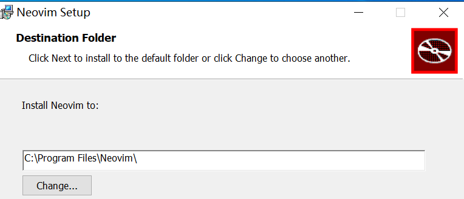

neovim会自动配置环境变量，可以直接在终端下使用

## 0x02.安装GCC

使用当前目录下的cygwin安装gcc即可。

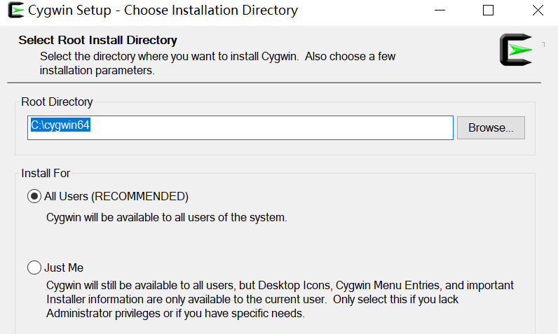

选择gcc-core安装gcc编译器。

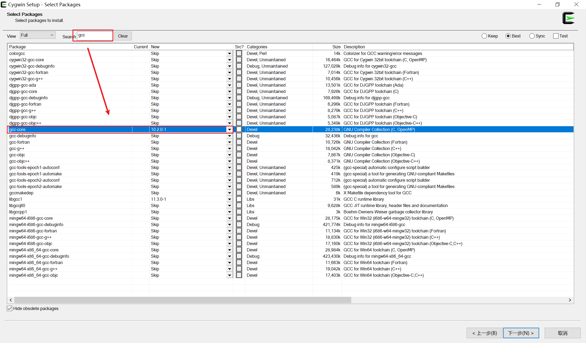

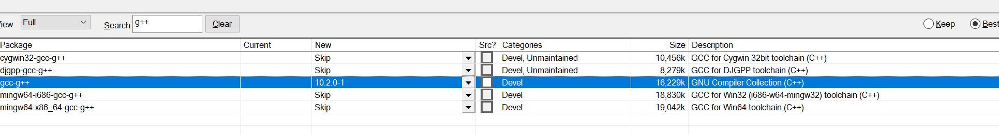

配置好gcc的环境变量。

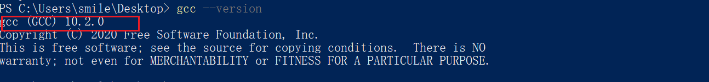

## 0x03.Lua

使用当前目录下的Lua.exe，可以将Lua放到自己喜欢的路径下，然后配置环境变量即可。

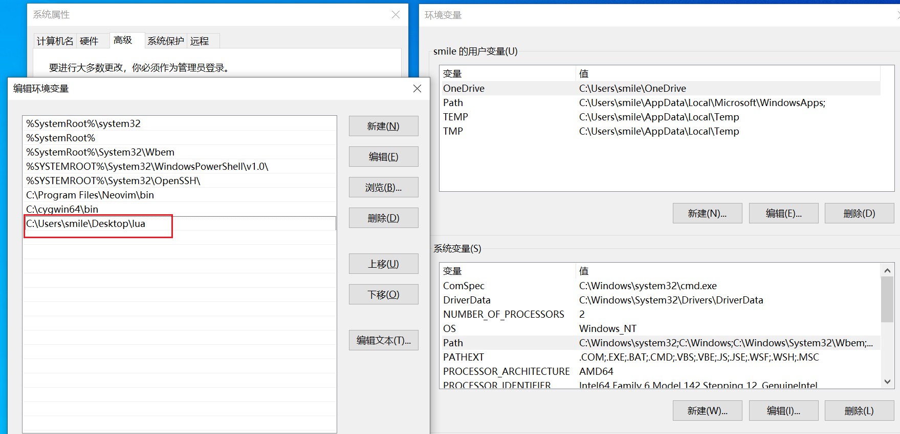

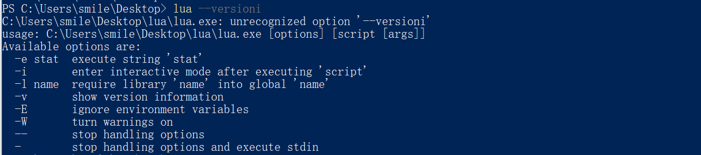

## 0x04.安装Git

使用默认安装即可。

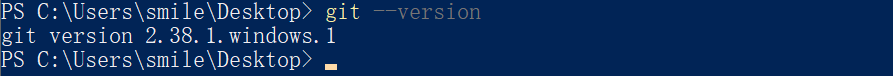

## 0x05.Neovim配置

克隆项目到对应目录

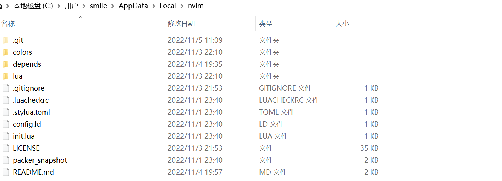

在当前目录下执行如下命令安装相neovim相关的插件

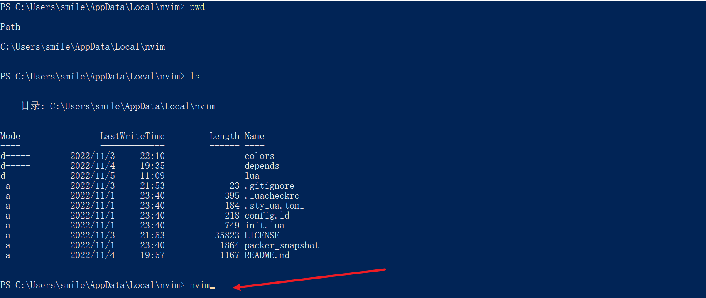

运行:PackerSyn同步相关插件

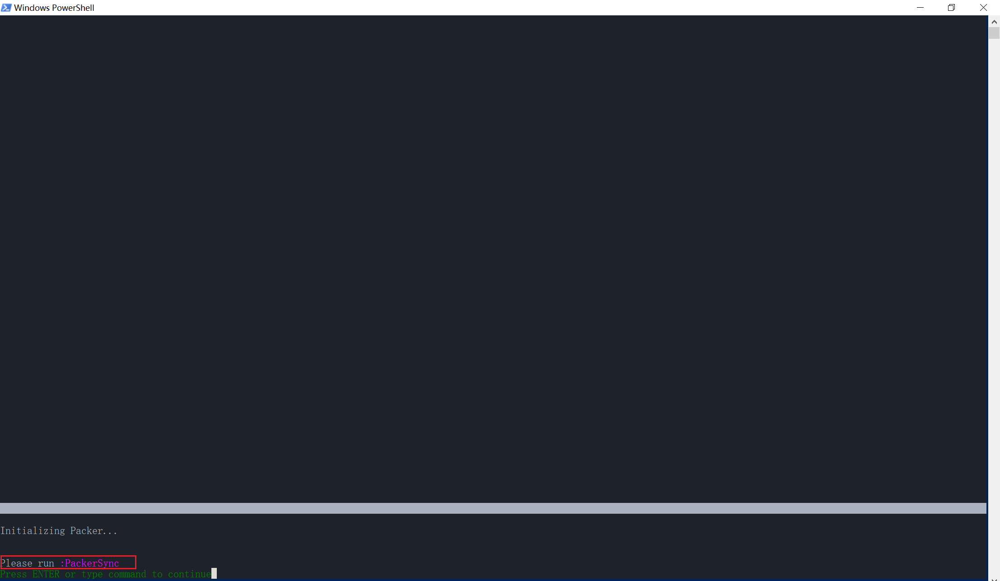

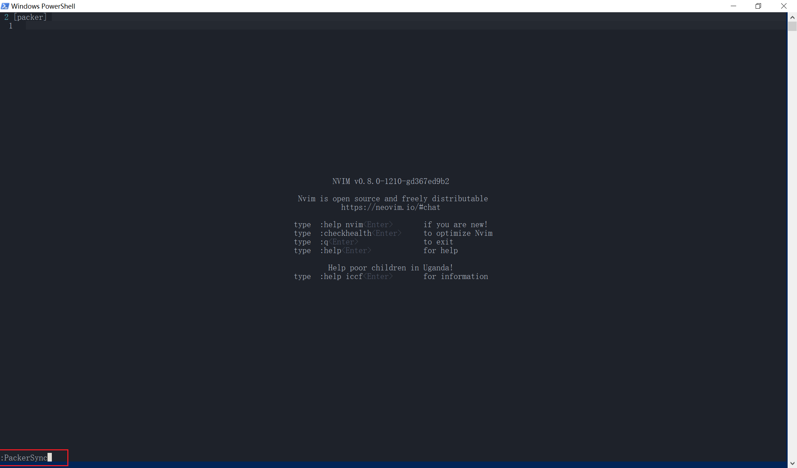

开始同步插件

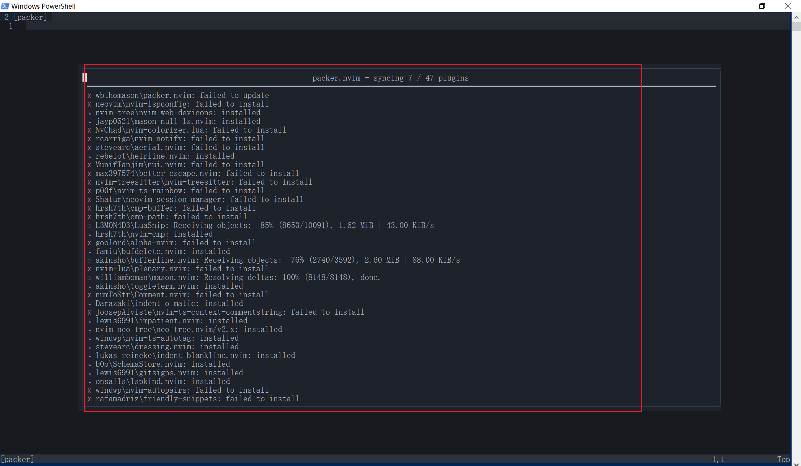